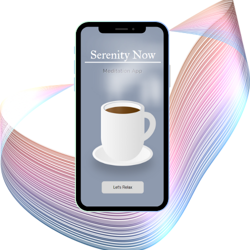

# Serenity Now - Meditation App

## Table of contents

- [Overview](#overview)
  - [The challenge](#the-challenge)
  - [Screenshot](#screenshot)
  - [Links](#links)
- [My process](#my-process)
  - [Built with](#built-with)
  - [What I learned](#what-i-learned)
  - [Continued development](#continued-development)
  - [Useful resources](#useful-resources)

## Overview

The Serenity Now App is a meditation and relaxation application that provides users with a selection of ambient sounds and calming visuals for a serene and immersive experience. The app is designed to offer a simple and intuitive interface, allowing users to choose from a curated playlist of 10-minute meditation sessions, each accompanied by a soothing background video and calming background music.

### The challenge

The primary challenge of this project was to create a mobile-friendly application that delivers a seamless user experience. Integrating both video and audio elements posed unique challenges in terms of performance optimization, ensuring fast loading times, and maintaining a visually appealing design across various devices.

### Screenshot

### Links

- Solution URL: https://github.com/Jud1th1/meditation-
- Live Site URL: https://serenity-now.netlify.app/

## My process

1. **Conceptualization**: I defined the concept and core features of the Serenity Now App, based on a few clock tutorials I followed online. I wanted to take what I learned and amplify it by creating a meditation app focusing on simplicity, ease of use, and an immersive meditation experience.

2. **Design and Styling**: I created a clean and visually pleasing design, incorporating a responsive layout to ensure an optimal experience on mobile devices. This project served as an opportunity to use a pure css image I made for the intro screen.

3. **Frontend Development**: Implemented the frontend using HTML, CSS, and JavaScript. Integrated the Swiper library for the playlist carousel and designed custom controls for video and audio playback.

4. **Audio Integration**: Utilized the HTML5 `<audio>` element to seamlessly integrate background music with play, pause, and reset controls.

5. **Testing**: Conducted extensive testing across various devices and browsers to ensure compatibility and performance. Made adjustments to enhance the user experience.

### Built with

- HTML
- Flexbox
- CSS
- Javascript
- Swiper bundle
- Mobile workflow

### What I learned

Throughout the development of the Serenity Now App, I learned several things:

- **Media Optimization**: Explored techniques for optimizing images and videos to enhance website performance and reduce loading times.

- **Mobile-First Design**: Focused on mobile-first design principles to create a responsive and user-friendly interface for a diverse range of devices.

- **Integration of Multimedia**: Gained experience in integrating multimedia elements, such as background videos and ambient sounds, while maintaining performance.

## Continued Development

The Serenity Now App is an ongoing project with plans for future enhancements and features, including:

- **Desktop Optimization**: Extending the app's compatibility and optimizing the user experience for desktop devices.

- **User Accounts**: Implementing user accounts to allow users to save preferences and track their meditation progress.

- **Expanded Playlist**: Adding more meditation sessions and diverse content to cater to a broader audience.
